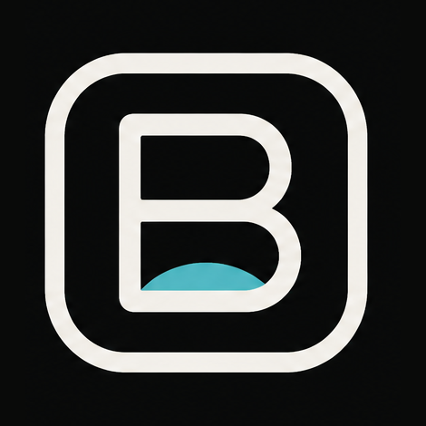
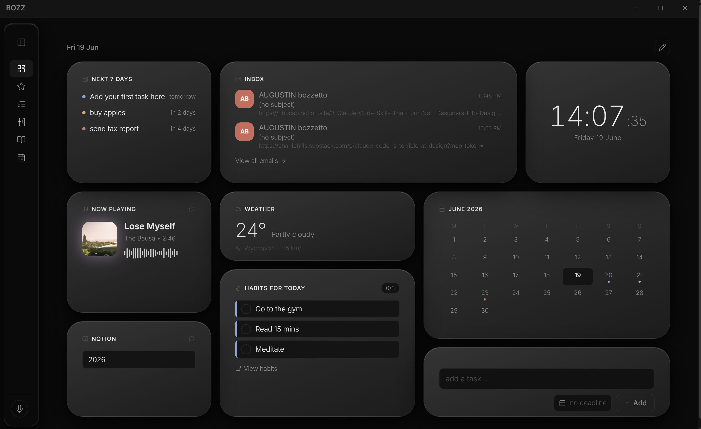
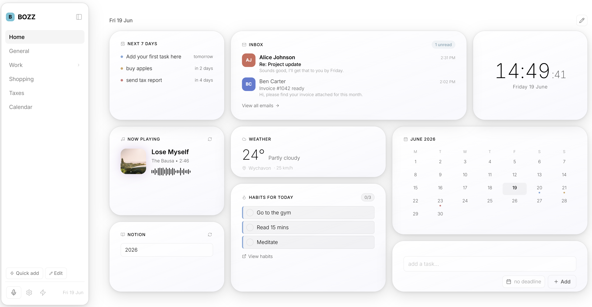
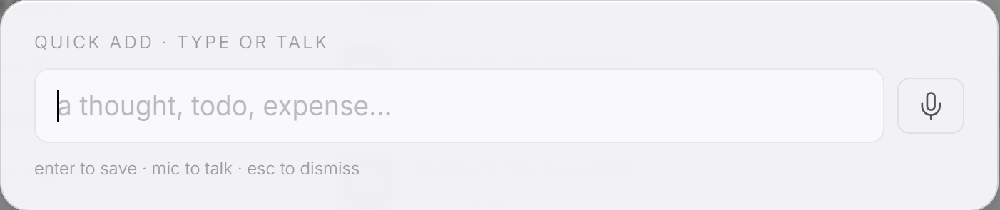
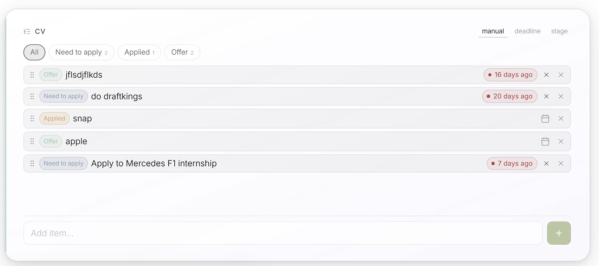

<div align="center">



# BOZZ

### Your morning, on screen in 90 seconds.

Bozz is the window you open before everything else — your tasks, calendar, budget and email in one calm desktop view. No configuration, no empty dashboard. Just your actual day, before the chaos starts.

<br />

[](https://github.com/augboz/bozz/releases/latest)
&nbsp;
[](https://bozz-app.vercel.app)

<br />


&nbsp;
[](LICENSE)
&nbsp;
[](https://github.com/augboz/bozz/releases/latest)
&nbsp;
[](https://github.com/augboz/bozz/stargazers)

<br />

<picture>
  <source media="(prefers-color-scheme: dark)" srcset="website/assets/hero-dark.png" />
  <source media="(prefers-color-scheme: light)" srcset="website/assets/hero-light.png" />
  
</picture>

</div>

<br />

## Why Bozz

Most mornings start the same way: Gmail in one tab, calendar in another, a task list somewhere, the bank app on your phone. You spend the first ten minutes context-switching before you've done anything.

Bozz puts all of it in **one native desktop window** — and lets you build **a different page for every part of your life**. One for work, one for finances, one for health, each with exactly the widgets it needs.

- 🌅 **Your day at a glance** — calendar, next 7 days, weather, time, and habits the moment you open it.
- 📄 **A page for everything** — topic-based dashboards you arrange yourself, not one rigid layout.
- ⚡ **Quick capture** — press a shortcut from any app, type or speak, and it's filed before the thought's gone.
- 📬 **Inbox, triaged** — Gmail and Outlook in your dashboard, with priority alerts for the emails that matter.
- 🔒 **Local-first by design** — runs on your device, your data lives in *your* Supabase project, tokens stay in your OS keychain. No ads, no trackers, never sold.
- 🎨 **Make it yours** — light and dark, customisable widget layouts, and curated aesthetic *Worlds* (themes, wallpapers, ambient sound).

<br />

## A look inside

<table>
  <tr>
    <td width="50%" align="center">
      <br />
      <sub><b>One calm view</b> — light mode</sub>
    </td>
    <td width="50%" align="center">
      <br />
      <sub><b>Same dashboard</b> — dark mode</sub>
    </td>
  </tr>
  <tr>
    <td align="center">
      <br />
      <sub><b>Quick add</b> — type or talk, from any app</sub>
    </td>
    <td align="center">
      <br />
      <sub><b>Topics &amp; tasks</b> — lists, stages and streaks</sub>
    </td>
  </tr>
</table>

<br />

## Download

Grab the latest installer from the [**Releases**](https://github.com/augboz/bozz/releases/latest) page:

| Platform | File |
| --- | --- |
| **Windows 10 / 11** | `Bozz-setup.exe` |
| **macOS (Apple Silicon)** | `Bozz-mac-arm.dmg` |
| **macOS (Intel)** | `Bozz-mac-intel.dmg` |

The app updates itself automatically on launch.

### Code signing

The Windows installer is code-signed through the free **[SignPath Foundation](https://signpath.org)** open-source code-signing program, so it's verified by Microsoft SmartScreen / Defender.

On **macOS**, if Gatekeeper reports *"Bozz is damaged and can't be opened"*, the build you downloaded predates notarization. This is the download-quarantine flag, not a corrupt file. Drag Bozz into **Applications**, then clear the flag in Terminal:

```bash
xattr -dr com.apple.quarantine /Applications/Bozz.app
```

Open it normally afterwards. Notarized builds (signed with an Apple Developer ID) open with no warning at all — see [docs/macos-signing.md](docs/macos-signing.md) for the release-side setup.

<br />

## Built with

[Tauri 2](https://tauri.app) · [React](https://react.dev) · [TypeScript](https://www.typescriptlang.org) · [Vite](https://vite.dev) · [Supabase](https://supabase.com) (sync) · Vercel serverless functions (OAuth token exchange).

<br />

## Privacy

Bozz stores your data in your own Supabase project and keeps integration tokens in your OS keychain. It does not sell your data or run third-party trackers. Full policy: **[Privacy Policy](https://bozz-app.vercel.app/privacy.html)**.

## Security

Found a vulnerability? Please report it privately — see [SECURITY.md](SECURITY.md). Do **not** open a public issue for security problems.

<br />

## License

Bozz is licensed under the **GNU Affero General Public License v3.0 (AGPL-3.0)** — see [LICENSE](LICENSE).

In short: you are free to use, study, and modify Bozz, but **if you distribute it or run a modified version as a network service, you must release your source code under the same AGPL-3.0 license.** This keeps Bozz and any derivative open-source. As the copyright holder, Augustin Bozzetto retains all rights and may also offer the software under separate terms.

*Note: a license protects this specific source code. It does not stop anyone from building a different app with similar ideas — that's true of all software.*

<br />

<div align="center">

**[Download Bozz](https://github.com/augboz/bozz/releases/latest)** · **[Website](https://bozz-app.vercel.app)** · **[Bozz Plus](https://bozz-app.vercel.app/plus.html)**

<sub>Built by one person in the open. Free forever.</sub>

<br />

© 2026 Augustin Bozzetto

</div>
